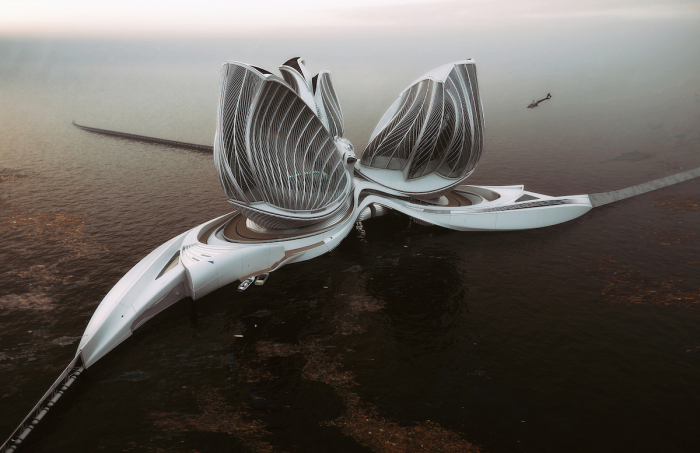
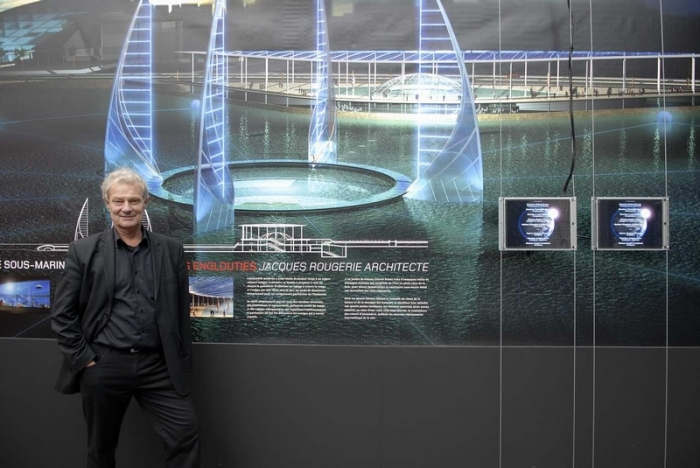
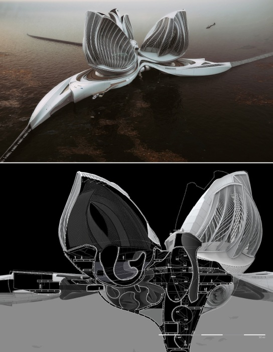
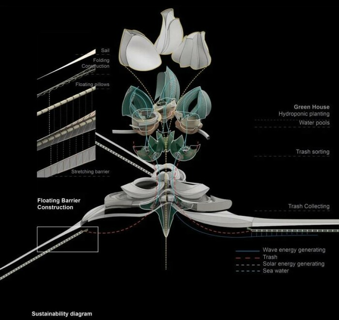

# The concept of a floating station for cleaning the ocean that looks like an alien ship

- Global problems of mankind do not bypass even designers. So, for example, Lenka Petrakova's ambitious concept "8 Continent" would help solve the super-complicated task of cleaning the waters of the World Ocean from garbage and plastic. This floating research station strikes not only with its futuristic forms. Its potential for solving global problems was so impressive that the project won the National Architecture Award for Green and Innovative Solutions for the Sea.

- Plastic has long been a headache for mankind, because it has filled not only all landfills and roadsides, but also the waters of the world's oceans. Environmentalists are sounding the alarm, and with good reason, as every year more than 8 million tons of plastic gets into the rivers, seas and oceans, which leads not only to the formation of islands but also to the formation of gigantic waste continents.

- Just look at the ever-growing Great Pacific garbage patch, which covers an area of 1.6 million square kilometers. And, worst of all, it is not alone on our planet. This accumulation of trash has catastrophic consequences, which not only environmentalists and the public are trying to prevent. Architects are also trying to contribute to this noble cause by creating unique projects the realization of which would help clean the planet from the accumulated garbage.

- One such project won the Grand Prix 2020 at the Jacques Rougerie Foundation International Competition. The National Architecture Prize is awarded for an outstanding contribution to green and innovative solutions, to the active development of the industry and is the highest French architectural award. The concept, entitled 8th Continent, was developed by Lenka Petráková, a Slovakian specialist and leading designer at Zaha Hadid Architects in London. She proposed the concept of a floating research station, which could be used to collect and recycle plastic. Lenka Petrakova's designs impress with both the possibilities and the futuristic glass forms emerging from the elegant spiral base.

## Interesting fact: The founder of the prize, oceanographer and architect Jacques Rougery, fascinated by the sea and new technologies that improve the environment, has not abandoned the hope to build an ideal world of the future. To this end, he set up a foundation with a €30,000 prize for those who strive to achieve excellence in the exploration and revitalization of the oceans.

- Last year, Jacques Rougery and the jury were struck by the concept of a floating station, a self-sufficient and fully autonomous structure that will be able to move thanks to the power of the sun, water (tidal power) and wind. The 8th Continent will not only perform a research function, but also actively purify the waters of the ocean.

